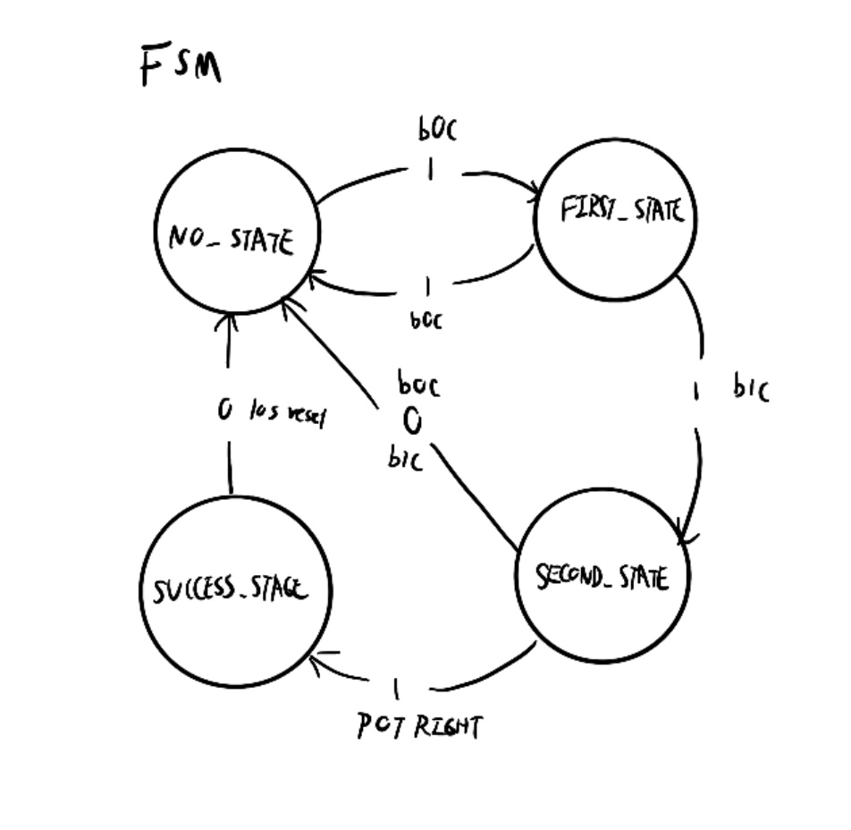
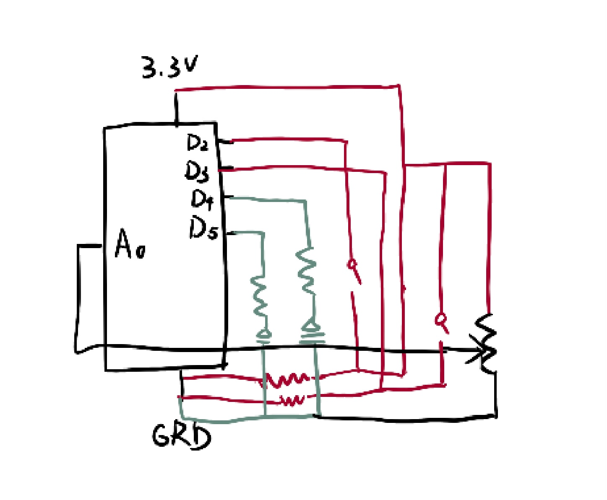
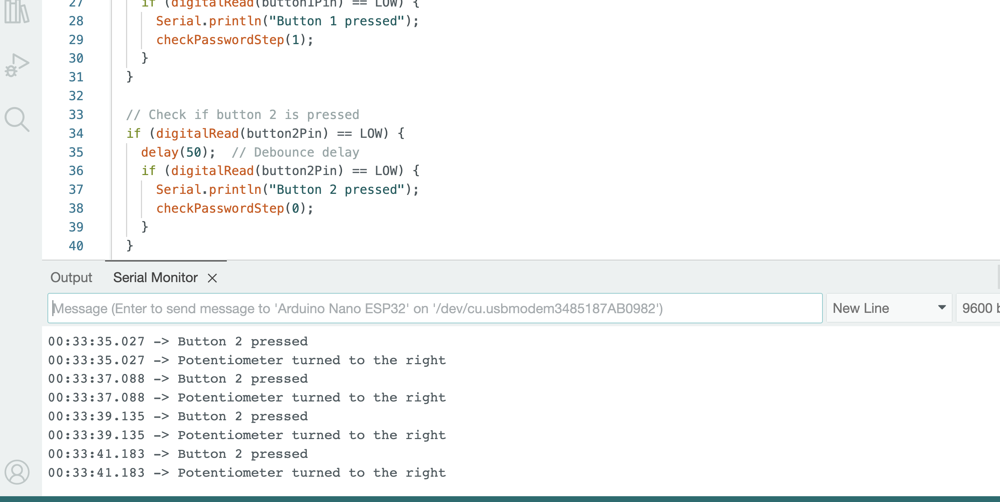
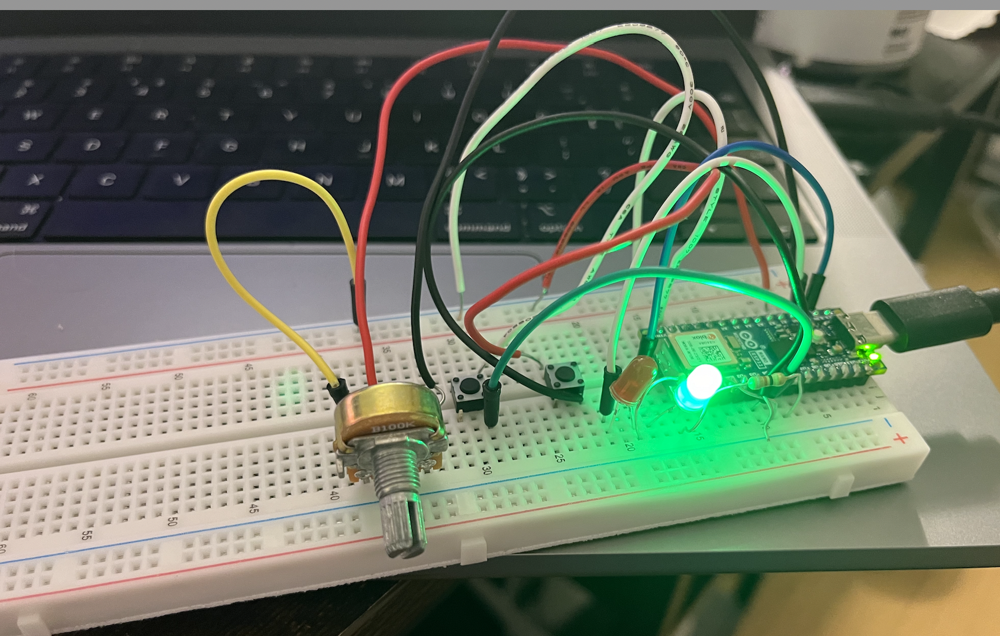
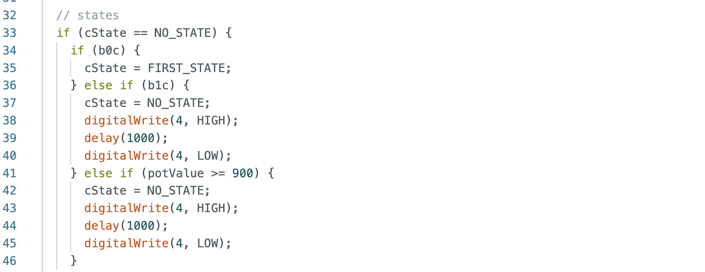

# Week11_2nd
 FSM disgram: 

Circuit:

I started this week by putting each object to each pin and write ifs in the loop to make them work in a loop. I used a lot of delays in the middle because I wanted to make sure the process is precise. I failed and tested for many times using the serial monitor.

Also a major problem I encountered was the button sometimes worked and sometimes not, as well as the LEDs. After going to the office hour, we fixed the wiring, especially the buttons without resistors. Here's the initial commit:
  

## After the OH
After I got home, I began looking at the clicky example. In the first round, for each transituon ifs I put repetitive instructions to led the light. Then I realized I can just put all of them in the states part together. 

After I wrapped up the code, the major problem remained to be wiring. I had to test again for what went wrong and re-position the chip after debugging. Leaving 4 holes for the crowded wiring pins helped solve the situation. I re-read the examples and check online coding a lot for debugging the problem of not jumping to State 2 after pressing the second button. Solved by adding a debouncing time. 

